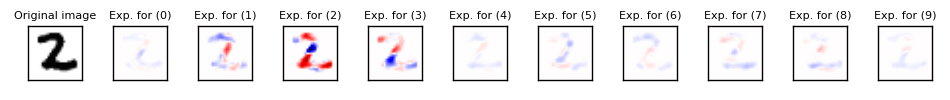
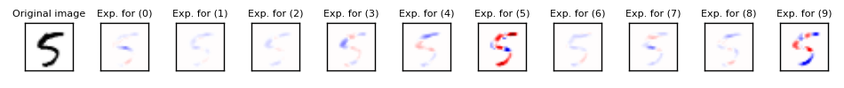
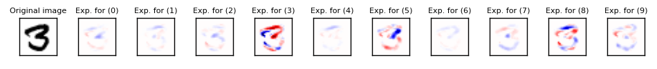
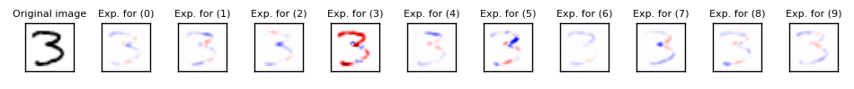
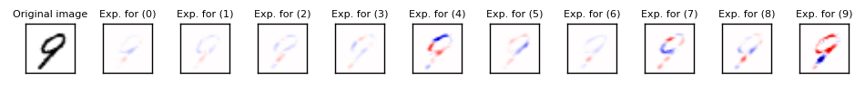
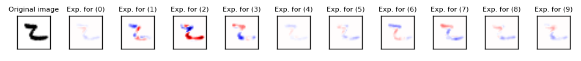

# Integrated Gradients
Python implementation of integrated gradients [1]. The algorithm "explains" a prediction of a Keras-based deep learning model by approximating Aumann–Shapley values and assigning them to the input sample features. 

# Usage

Using Integrated_Gradients is very easy. There is no need to modify your Keras model.  
Here is a minimal working example on UCI Iris data.

1. Build your own Keras model and train it.
``` Python
from IntegratedGradients import *
from keras.layers import Dense
from keras.layers.core import Activation

X = np.array([[float(j) for j in i.rstrip().split(",")[:-1]] for i in open("iris.data").readlines()][:-1])
Y = np.array([0 for i in range(100)] + [1 for i in range(50)])

model = Sequential([
    Dense(1, input_dim=4),
    Activation('sigmoid'),
])
model.compile(optimizer='sgd', loss='binary_crossentropy')
model.fit(X, Y, epochs=300, batch_size=10, validation_split=0.2, verbose=0)
```

2. Wrap it with an integrated_gradients instance.
``` Python
ig = integrated_gradients(model)
```

3. Call explain() with a sample to explain.
``` Python
ig.explain(X[0])
==> array([-0.25757075, -0.24014562,  0.12732635,  0.00960122])
```

More thorough examle can be found [here](examples/example.ipynb).

# Features
- supports both Sequential() and Model() instances.
- supports both **TensorFlow** and **Theano** backends.
- works on models with multiple outputs.

# How does it work?

Integrated gradients algorithm work by estimating the Shapley values for all features of an input sample. Here is a quote from Wikipedia explaining what it is: "The Shapley value is a solution concept in cooperative game theory. It was named in honour of Lloyd Shapley, who introduced it in 1953. To each cooperative game it assigns a unique distribution (among the players) of a total surplus generated by the coalition of all players. (Wikipedia)". Frankly speaking, the algorithm will calculate how much the difference between each pair of pixels from current and default input (e.g. all black pixels for images) affects prediction. If the difference in a pixel changes the prediction a lot, it means that the pixel is very "important" for making the prediction.

# MNIST example
We trained a simple CNN model (1 conv layer and 1 dense layer) on the MNIST imagesets. 
Here are some results of running integrated_gradients on the trained model and explaining some samples.









# References
1. Sundararajan, Mukund, Ankur Taly, and Qiqi Yan. "Axiomatic Attribution for Deep Networks." arXiv preprint arXiv:1703.01365 (2017).
2. Lundberg, Scott, and Su-In Lee. "An unexpected unity among methods for interpreting model predictions." arXiv preprint arXiv:1611.07478 (2016).

Email me at hiranumn at cs dot washington dot edu for questions.
